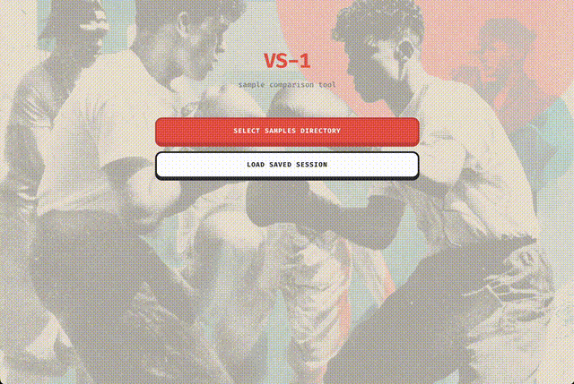

# VS-1

Audio sample tournament sorter. Quickly find the best samples in large libraries through pairwise comparison.



## Features

- Scan directories for audio files (WAV, MP3, FLAC, OGG, AIFF, M4A)
- Swiss-style tournament ranking
- Keyboard-driven workflow
- Save/load session progress
- Export results

## Keyboard Shortcuts

| Key | Action |
|-----|--------|
| Q | Play sample A |
| W | Play sample B |
| Enter | Select last played |
| X | Skip both |
| Space | Stop playback |
| L | Leaderboard |
| Cmd+S | Save |

## Development

```bash
npm install
npm run tauri dev
```

## Build

```bash
npm run tauri build
```
